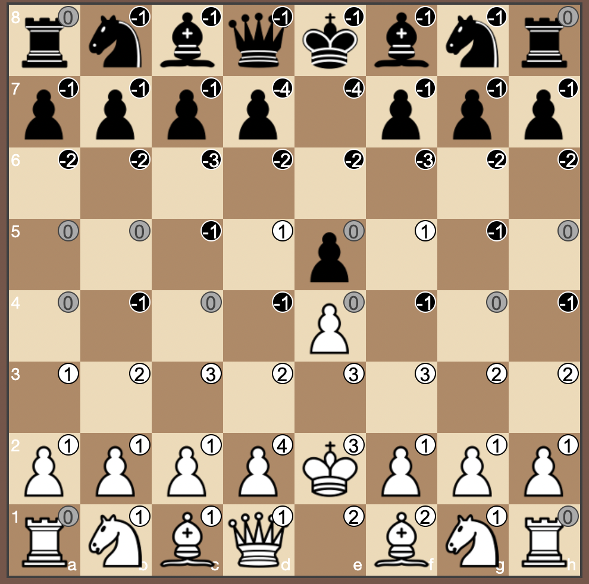

# Chassist

Try it [here](https://ofietze.github.io/chassist/)

Improve your chess vision! Chassist shows you the number of pieces that attack/defend a square.
Explore a catalog of openings or move the pieces to the position you want.

Using:

- [chessboard.js](https://github.com/oakmac/chessboardjs)
- [chess.js](https://github.com/jhlywa/chess.js)

## TODO

- try different designs for assist values
