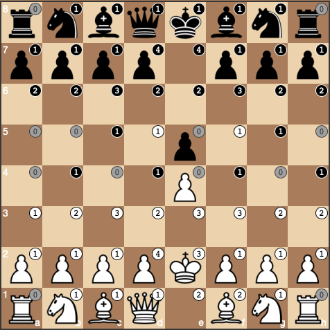

# Chassist

Improve your chess vision! Chassist shows you which squares are attacked/defended.

Using:

- [chessboard.js](https://github.com/oakmac/chessboardjs)
- [chess.js](https://github.com/jhlywa/chess.js)

## TODO

- try different designs for assist values
